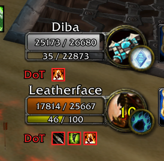

*[Read in English](README.md)*

# Nidhaus UnitFrames (NUF)

Addon de interfaz orientado a PvP para World of Warcraft WotLK 3.3.5a (Warmane Blackrock y otros servidores privados).

NUF combina y reescribe varios addons existentes — entre ellos Eazy Frames y sArena — con funciones propias, en un solo paquete enfocado en interfaz y PvP y configurable desde un único panel dentro del juego.

> ## Descarga
>
> **Última versión: 4.3** — es la build actual, la recomendada y la que está en uso.
>
> **[Descargar v4.3 (última release)](../../releases/latest)**
>
> Una sola descarga, todo incluido: el addon y su panel de opciones.

## Funciones

- **Marcos de unidad** — jugador, objetivo, foco, grupo y boss, con skins propias, colores de clase y escala por marco.
- **Arena** — marcos de arena en dos estilos (Default y Flat) con trinkets, iconos de especialización, DR, DoTs y cuenta regresiva, y un modo de prueba para ubicarlos fuera de una partida.
- **Grupo** — disposición 3v3 para arena con escala por miembro, y un modo de prueba para acomodar el grupo estando solo.
- **Move Everything** — arrastrá cualquier marco y cambiale el tamaño con Ctrl + rueda.
- **Módulos opcionales** — barras de acción, trackers de clase, tooltip, chat y extras de comodidad, cada uno se prende o apaga desde el panel.
- **Character Setup** — copiá barras de acción, macros y bindeos entre personajes (nExtraBars incluido).
- **Perfiles** — exportá e importá toda tu configuración.

   

| Marcos de grupo | Objetivos del grupo | NiceDamage |
|:-:|:-:|:-:|
|  |  |  |

## Instalación

1. Descargá la **v4.3** desde la [página de releases](../../releases/latest).
2. Extraé el archivo. Vas a obtener dos carpetas: `Nidhaus_UnitFrames` y `Nidhaus_UnitFrames_Config`.
3. Copiá **las dos** carpetas a tu directorio `Interface/AddOns/` de WoW.
4. Reiniciá el cliente, o escribí `/reload` si ya estás en el juego.
5. Activá los dos addons en la pantalla de selección de personaje.

> **¿Venís de una versión anterior?** Borrá la carpeta vieja `Nidhaus_UnitFrames` antes de copiar la nueva, en vez de superponerla: entre releases se reorganizan archivos y los restos de una build anterior pueden dar errores. Tu configuración vive en la carpeta `WTF` y se conserva.

> Si bajás el repositorio con el botón verde *Code* en vez de la release, la carpeta extraída se va a llamar `Nidhaus_UnitFrames-main` y va a tener las dos carpetas adentro. Copiá esas dos carpetas a `Interface/AddOns/` — no copies `Nidhaus_UnitFrames-main` en sí.

## Comandos

| Comando | Acción |
|---------|--------|
| `/nuf` | Abre el panel de opciones |
| `/nuf config` | Muestra las variables guardadas en el chat |
| `/nuf arena` | Activa el modo de prueba de arena |
| `/nuf boss` | Activa el modo de prueba de marcos de boss |
| `/nuf reset` | Restablece toda la configuración |
| `/nuf modules` | Lista los módulos y su estado |
| `/move` o `/nufmove` | Modo desbloquear todo: mové cualquier marco arrastrándolo |

El botón del minimapa también sirve de atajo: click izquierdo abre las opciones, click derecho activa el mover de arena.

## Compatibilidad

- **Cliente:** WoW 3.3.5a (WotLK)
- **Probado en:** Warmane Blackrock
- **API:** compatible con el sandbox Lua de 3.3.5a (sin HTTP, sin llamadas de hardware)

## Créditos

NUF está construido sobre el trabajo de mucha gente. El motor y varios módulos son ports o adaptaciones, y el crédito de esos es de sus autores originales:

| Proyecto original | Autor | Usado para |
|---|---|---|
| Eazy Frames, Sarena | — | Base del trabajo de marcos de unidad |
| pw_unitframes | — | Bordes de auras, barras de casteo, PartyFramePW, estilo Square de PartyTargets |
| RE/TabBinder | Veev, AcidWeb | TabBinder |
| TipTacTalents | Aezay | Talentos en el tooltip |
| PvPRating | Fernir | Experiencia de arena en el tooltip |
| AuraSource | Renstrom | Quien lanzo el buff, en el tooltip |
| FriskesUI | Friskes | MiniBar (FriskesBar) |
| RougeUI | — | ClassOutline |
| MageNuggets | — | ClassTimers |
| MySlot | tg123 | SlotProfiles |
| MobileEnergy | B-Buck | PowerBar |
| ZAutoShot | — | AutoShotTimer |
| ShieldWatch | — | ShieldWatch |
| !ComboWatch | — | ComboWatch |
| DisplayDungeon | Smokey | DungeonRoles |
| PartyFramesImproved | SoupsBelly, que viene de UnitFramesImproved (kiforsbe) y PartyTarget (Valconeye) | PartyFramesImproved |
| Abbreviated Status Text | RomanSpector | AbbreviatedStatus (reimplementado) |
| Arena Points Calculator | — | ArenaPointsCalc |
| AutoSell, ErrorHide | FatalEntity | Ambos módulos |
| Varias WeakAuras | — | PaladinAuras, SacredShield, SacredShieldTracker, SeductionAlert, EnemySpellAlert, temporizador de Dalaran |

Integración, port a 3.3.5a, corrección de bugs y todo lo demás: **Nidhaus**.

## Changelog

### v4.3
- Arreglado el cartel "Nidhaus_UnitFrames has been blocked from an action only available to the Blizzard UI". Varias partes del addon dejaban "manchado" (taint) el código de Blizzard: Party Buffs (llamaba a las funciones de auras de Blizzard y les sacaba el UNIT_AURA a los marcos del grupo), el bloqueo de color de la barra de vida del objetivo y del foco, el repintado del color de clase, los iconos por fila de los buffs y los iconos de los tooltips (les ponían scripts a los tooltips de Blizzard). Ahora todo funciona sin tocar el código de Blizzard.
- Vehículos: al bajar de un demoledor las barras de acción no se podían clickear y las laterales derechas desaparecían. Arreglado: el porcentaje del texto de estado ya no les pone scripts a las barras de Blizzard.
- Marcos del grupo: su escala y su lugar ya no se cambian en combate (el juego lo bloqueaba al hacer /reload dentro de un BG); se aplican al terminar la pelea. Los nombres del estilo Compact ya no pisan el borde del marco al salir de un BG.
- Action Bar Scale: las barras de nExtraBars y el micromenú crecen y se achican con él, y las bolsas ya no vuelven solas a 1.
- Revisión general del escalado:
  - Ctrl + rueda en Mover todo guarda en el mismo lugar que el slider y mueve el slider. La rueda no pasa de los topes del slider.
  - Las escalas de los módulos se aplican al entrar: Gargoyle, timers de arena, cuenta regresiva, buffs/debuffs, alerta de hechizos, DTSU, Sacred Shield, Seducción, auras de Paladín y Turn Evil. Antes volvían a 1 después de un /reload.
  - La barra 1 con la rueda es el Action Bar Scale (todas las barras, las bolsas, el micromenú y nExtraBars). El slider manda sobre las tres barras: al moverlo se borra la escala que una barra tuviera de la rueda.
  - Los números de la cuenta regresiva, los buffs sin posición propia y los marcos de Paladín / Turn Evil siguen a su slider; la rueda sobre la barra de casteo escala también la del objetivo; el Reset deja cada uno en su valor de fábrica.
  - Nuevo slider de tamaño del ojo (Shadow Sight) en Arena, con los otros timers.
- Party Buffs: al apagar el módulo se ocultan todos los buffs del grupo (antes quedaban los cuatro primeros en pantalla).

### v4.2
- Tiempo restante de la arena ("Arena: 28:07"): se apaga cuando termina la partida o cuando salís de la arena. Antes seguía contando en el mundo.
- Pilares del Círculo del Valor: el timer va cada 25s, también el primer ciclo, y se apaga al terminar la partida.
- Timer del ojo (Shadow Sight): se ve en minutos y segundos (1:20) y se mueve como los otros timers de arena (Alt + arrastrar, /nuftimers, Mover todo, Ctrl + rueda para el tamaño).
- El tiempo de cola al lado del minimapa muestra 0:05 en vez de 0:5.
- Texto de estado: el porcentaje del texto abreviado usa la misma fuente, tamaño y capa que el número (en el grupo el "100%" salía más grande y el del maná cortado), se oculta junto con "Ocultar texto vida/maná", cambiar el estilo del grupo ya no deja los textos encimados, apagar el abreviado devuelve el número a su lugar, y en cero se ve "0" en vez de "0 / 100".
- Texto grande: el cartel "Group N" arriba del marco del jugador se oculta para no tapar el nombre.
- Pestaña Mascota: nueva opción "Ocultar texto de vida / energía".
- Party Buffs: ya no sale el error "PartyMemberFrame_RefreshDebuffs (a nil value)" con Party Debuffs apagado.

### v4.1
- Todo en español e inglés: cada texto visible sigue el idioma del juego. Incluye las opciones, los tooltips, los mensajes del chat y las alertas de los módulos (Arena Calculator, Arena Times, Arrow Count, Auto Repair, los timers de Auto Shot y Melee Swing, Button Range, Class Icons, Dungeon Roles, MiniBar, Paladin Auras, Sacred Shield, Seduction Alert, Party Buffs, Party Castbars, Party Pet Target, Party Targets, Power Bar, Spec Icons, System Spam Filter y más), los nombres de Move Everything y las opciones de Lorti UI.
- Descarga más liviana: la release trae el código sin comentarios (1,5 MB de Lua en vez de 2,3 MB). Es el mismo código, así que los números de línea de un error siguen coincidiendo con el de este repositorio.

### v4.0
- Nueva pestaña DR en Arena: iconos de rendimientos decrecientes en cada enemigo de arena (1/2, 1/4, inmune), con vista previa, arrastre con Shift+Alt, dirección de crecimiento, tamaño, separación y borde del color del nivel. Elegís qué categorías ver (Todas, Mi clase, Ninguna o una por una; al pasar el mouse por una categoría se ven los hechizos que la comparten), y cada icono muestra los segundos que faltan para que se resetee el DR.
- Nueva pestaña DoT en Arena: marca a los enemigos que tienen un daño en el tiempo encima, con las mismas opciones de vista previa y posición.
- Arena > Frames reorganizada: escala y estilo arriba, y una sola fila de vista previa 2v2 / 3v3 / 5v5 / Ocultar en lugar de Show Arena Frame más los botones de Test. Las mascotas del test siguen la cantidad de marcos y ya no quedan en pantalla al cerrarlo.
- El timer de Shadow Sight arranca con el mensaje de inicio de la arena y se corta al terminar la partida.
- "Arena Points" ahora se llama "Arena Calculator".
- Los marcos de arena, del grupo y de las mascotas ya no se mueven, escalan ni esconden en combate (el juego lo bloquea): esos cambios esperan a que termine la pelea. Se van los errores de "acción bloqueada" que llenaban el taint log.
- Party Buffs y Party Debuffs ahora son opciones separadas, cada una con su Castable Buffs / Dispellable Debuffs, sincronizadas con las opciones de Interfaz de Blizzard.
- Party Targets: icono de clase opcional en el retrato, y "Ocultar el nombre del objetivo" ahora anda siempre.
- Las ventanas de Party Castbars y Party Buffs se abren por encima del panel de NUF, con fondo sólido.
- Texto grande (Interface > General > Status Text): sube el nombre por encima de los marcos de jugador, objetivo y foco y centra el número de vida, con tamaño opcional para el texto de vida y de maná. Disponible con los temas Light, Dark y Compact.
- Texto abreviado: posiciones por defecto para los marcos de Blizzard, y un juego de posiciones aparte para el texto grande.
- El borde Lorti UI del minimapa funciona con el minimapa cuadrado, se aplica sin /reload y es la misma opción que Lorti UI > Minimap en la pestaña Addons.
- nExtraBars: la barra de posturas / auras / presencias queda por encima de la barra izquierda de nExtraBars en vez de debajo.
- Chat Copy funciona en las pestañas de susurro.
- El Gargoyle Tracker se cierra cuando muere la gárgola, cuando termina la partida o al cambiar de zona.
- Perfiles: exportar e importar incluyen las posiciones y escalas de Move Everything, y cada personaje se guarda al entrar y al salir para Perfiles / MySlot.
- Los resets usan las escalas y posiciones de fábrica reales, y los botones del panel ya no escriben en el chat.
- Más liviano en combate: Spec Icons solo lee el combat log en arenas, BGs y duelos, y el timer del Gargoyle Tracker duerme mientras no hay gárgola.
- Fixes arreglados.

### v3.9
- Pestana Pet: checkbox de Pet Buffs, un boton Move que destraba solo el marco de la mascota (sin los marcos de prueba del grupo, el de arena ni la consola) y un Reset que toca solo la mascota. Antes le cambiaba el tamano a los marcos del grupo con el 3v3 puesto: la escala del grupo tenia un tercer dueno escondido en las posiciones del modo mover. Los valores viejos guardados se borran solos.
- Modo party 3v3: la escala ya no se rompe al volver a prenderlo despues de usar Party Frame Scale, los marcos del grupo que arrastras con el 3v3 puesto quedan donde los soltas, y el checkbox y los cuatro sliders por miembro estan tambien en Frames > General.
- Un solo boton "Reiniciar escalas y posiciones" para los marcos de unidad: escala y posicion juntas, sliders del 3v3 incluidos, respetando el 3v3 y sin /reload.
- Focus Scale se aplica en vivo mientras arrastras. Una entrada muerta en la tabla de escalas hacia que el slider se saltara el camino en vivo.
- Cambiar el estilo de los marcos o la textura custom se aplica al instante en vez de pedir /reload.
- Frames > General reorganizado: escalas arriba en dos columnas parejas (Player / Target / Focus y 3v3), posicion abajo con Unlock y Reset lado a lado.
- Character Setup ahora incluye nExtraBars: los 24 botones de los dos talentos, sus macros, que barras estan prendidas, cantidad de botones y bloqueo. Clear Bars y Undo tambien las cubren. Cada personaje se guarda ademas al salir, asi se copia lo que armaste durante la sesion. Con nExtraBars 2.2.3 la config de las barras se aplica sin /reload.
- Party Casting Bars: mover una barra mueve las cuatro, y su reset devuelve las cuatro.
- Hide Action Bar Textures y el "Hide bar background" de MiniBar ya no se pelean al prenderlos y apagarlos.
- Contador de municion: boton Lock / Unlock, `/arrowcount lock | unlock`, y se traba solo en combate.
- Los resets ya no escriben en el chat.

### v3.8
- El nombre de los companeros de party ya no se desliza sobre la barra de vida en plena pelea. Blizzard lo reancla en cada actualizacion del grupo, y el reestilado se cortaba en combate.
- Character Setup lista solo personajes de tu clase. Las otras cuentas de WoW siguen siendo Exportar / Importar: el juego nunca carga sus datos.
- El Gargoyle Tracker anda en cualquier idioma. El nombre de la criatura se aprende del evento de invocacion en vez de venir fijo en ingles, y se recuerda por idioma.
- Se fue la franja gris que quedaba debajo de las barras de accion. Se la buscaba por un nombre que no existe, asi que nunca se ocultaba nada y nunca saltaba ningun error.
- Arena: test de 2, 3 y 5 marcos como sArena; Pet Style solo en el estilo Flat; ancho por defecto de Flat en 100.
- El Arena Points Calculator aparece al primer toggle en vez de necesitar un cambio de pestana, y su posicion quedo fija.
- El modo de party 3v3 no tenia ninguna guarda de combate; ahora si.
- Lorti UI vuelve a tenir el marco del objetivo de party.
- La pestana de perfiles ahora se llama "Perfiles / MySlot", y el boton del pie se mide segun su texto en vez de un ancho fijo.

### v3.7
- En vehiculo, los marcos de party vuelven a la barra de vida y al fondo propios de Blizzard.
- MiniBar ya no pelea con la barra del vehiculo mientras manejas (demoledores, canones).
- El micromenu queda por encima de la barra del vehiculo en vez de dibujarse detras de su chapa.
- Los tiempos de control del Gargoyle Tracker respetan la duracion en PvP (Turn Evil marca 10s, no 20s).
- Move Everything solo ofrece el marco de mascota a las clases que realmente tienen una.
- La barra de casteo mantiene escala y posicion al encenderla y apagarla, y sigue andando con Move Everything.
- El desplegable de perfiles agrupa los personajes por reino en vez de irse de pantalla.
- Marcos de mascota para party1-4, solo en arena por defecto (`/ppf arena`).
- Las pestanas de la ventana de opciones se achican y se juntan al achicar la ventana.
- Minimapa: la forma cuadrada ahora carga la textura del borde default de Blizzard.
- La casilla de marcos de arena y las sub-opciones de Lorti UI llamaban a funciones que no existian; las dos andan.
- Sacados los comandos de diagnostico que habian quedado.
- Traduccion al espanol completa: no queda ninguna cadena sin su version en ambos idiomas.

### v3.6
- Arregladas las opciones del menú de estilos
- Arreglados problemas de visualización de texto
- Arreglados varios bugs de marcos
- El panel de opciones ahora viene junto al addon, en la misma descarga

## Licencia

Todos los derechos reservados. Este addon se provee tal cual, para uso personal.
