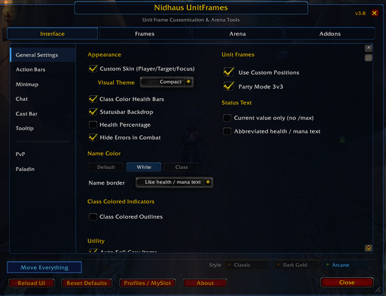

*[Leer en español](README.es.md)*

# Nidhaus UnitFrames (NUF)

A PvP-focused UI addon for World of Warcraft WotLK 3.3.5a (Warmane Blackrock and other private servers).

NUF combines and reworks several existing addons — Eazy Frames and sArena among them — with its own features into one package focused on UI and PvP, all set up from a single in-game panel.

> ## Download
>
> **Latest version: 3.9.2** — this is the current, recommended build and the one actively in use.
>
> **[Download v3.9.2 (latest release)](../../releases/latest)**
>
> One download, everything included: the addon and its options panel.

## Features

- **Unit frames** — player, target, focus, party and boss, with custom skins, class colors and per-frame scale.
- **Arena** — arena frames in two styles (Default and Flat) with trinkets, spec icons and countdown, plus a test mode to place them outside a match.
- **Party** — 3v3 arena layout with per-member scale, and a test mode to arrange the group while you are alone.
- **Move Everything** — drag any frame and resize it with Ctrl + mouse wheel.
- **Optional modules** — action bars, class trackers, tooltip, chat and quality-of-life extras, each one on or off from the panel.
- **Character Setup** — copy action bars, macros and keybinds between characters (nExtraBars included).
- **Profiles** — export and import your whole configuration.

  

| New Party Frame | Party Targets | NiceDamage |
|:-:|:-:|:-:|
|  |  |  |

## Installation

1. Download **v3.9.2** from the [releases page](../../releases/latest).
2. Extract the archive. You will get two folders: `Nidhaus_UnitFrames` and `Nidhaus_UnitFrames_Config`.
3. Copy **both** folders into your WoW `Interface/AddOns/` directory.
4. Restart the WoW client, or type `/reload` if you are already in-game.
5. Enable both addons on the character selection screen.

> **Updating from an older version?** Delete the old `Nidhaus_UnitFrames` folder before copying the new
> one instead of overwriting it — files get reorganised between releases, and leftovers can cause
> errors. Your saved settings live in the `WTF` folder and are preserved.

> If you download the repository with the green *Code* button instead of the release, the extracted folder
> will be named `Nidhaus_UnitFrames-main` and will contain both addon folders inside it. Copy the two
> folders out of it into `Interface/AddOns/` — do not copy `Nidhaus_UnitFrames-main` itself.

## Slash Commands

| Command | Action |
|---------|--------|
| `/nuf` | Open the options panel |
| `/nuf config` | Show saved variables in chat |
| `/nuf arena` | Toggle arena test mode |
| `/nuf boss` | Toggle boss test mode |
| `/nuf reset` | Reset all settings to default |
| `/nuf modules` | List all modules and their status |
| `/move` or `/nufmove` | Move Everything: unlock every frame and drag it |

The minimap button also provides quick access: left-click opens the options panel, right-click toggles the arena mover.

## Compatibility

- **Client:** WoW 3.3.5a (WotLK)
- **Tested on:** Warmane Blackrock
- **API Level:** Compatible with 3.3.5a Lua sandbox (no HTTP, no hardware calls)

## Credits

NUF is built on the work of a lot of other people. The engine and several modules are ports or
adaptations, and the credit for those belongs to their original authors:

| Original project | Author | Used for |
|---|---|---|
| Eazy Frames, Sarena | — | Base of the unit frame work |
| pw_unitframes | — | Aura borders, cast bars, PartyFramePW, PartyTargets Square style |
| RE/TabBinder | Veev, AcidWeb | TabBinder |
| TipTacTalents | Aezay | Talents in the tooltip |
| PvPRating | Fernir | Arena experience in the tooltip |
| AuraSource | Renstrom | Buff caster in the tooltip |
| FriskesUI | Friskes | MiniBar (FriskesBar) |
| RougeUI | — | ClassOutline |
| MageNuggets | — | ClassTimers |
| MySlot | tg123 | SlotProfiles |
| MobileEnergy | B-Buck | PowerBar |
| ZAutoShot | — | AutoShotTimer |
| ShieldWatch | — | ShieldWatch |
| !ComboWatch | — | ComboWatch |
| DisplayDungeon | Smokey | DungeonRoles |
| PartyFramesImproved | SoupsBelly, from UnitFramesImproved (kiforsbe) and PartyTarget (Valconeye) | PartyFramesImproved |
| Abbreviated Status Text | RomanSpector | AbbreviatedStatus (reimplemented) |
| Arena Points Calculator | — | ArenaPointsCalc |
| AutoSell, ErrorHide | FatalEntity | Both modules |
| Various WeakAuras | — | PaladinAuras, SacredShield, SacredShieldTracker, SeductionAlert, EnemySpellAlert, Dalaran pipe timer |

Integration, porting to 3.3.5a, bug fixing and everything else: **Nidhaus**.

## Changelog

### v3.9.2
- Bug fixes.

### v3.9.1
- Bug fixes.

### v3.9
- Pet tab: Pet Buffs checkbox, a Move button that unlocks only the pet frame (no party test frames, arena mover or console), and a Reset that only touches the pet. It used to resize the party frames with 3v3 on: the party scale had a third, hidden owner in the move-mode positions. Old saved values are dropped automatically.
- 3v3 party mode: the scale no longer breaks when you turn it back on after using Party Frame Scale, party frames dragged with 3v3 on stay where you drop them, and the checkbox and the four per-member sliders are mirrored in Frames > General.
- One "Reset Scales & Positions" button for the unit frames: scale and position together, 3v3 sliders included, respecting 3v3 and without /reload.
- Focus Scale applies live while dragging. A dead entry in the scale table made the slider skip its live path.
- Switching the unit frame style or the custom texture applies at once instead of asking for /reload.
- Frames > General reorganized: scales on top in two even columns (Player / Target / Focus and 3v3), position below with Unlock and Reset side by side.
- Character Setup now includes nExtraBars: the 24 buttons of both talent specs, their macros, which bars are enabled, button count and lock. Clear Bars and Undo cover them too. Each character is also saved on logout, so what you set up during the session is what gets copied. With nExtraBars 2.2.3 the bar settings apply without /reload.
- Party Casting Bars: moving one bar moves all four, and their reset brings back all four.
- Hide Action Bar Textures and MiniBar's "Hide bar background" no longer fight each other when toggled.
- Ammo counter: Lock / Unlock button, `/arrowcount lock | unlock`, and it locks itself in combat.
- The resets no longer print to chat.

### v3.8
- Party member names no longer slide down over the health bar during a fight. Blizzard re-anchors them on every party update, and the restyle was skipped in combat.
- Character Setup only lists characters of your own class. Other WoW accounts still need Export / Import: the game never loads their data.
- Gargoyle Tracker works in any client language. The creature name is learned from the summon event instead of being hardcoded in English, and is remembered per language.
- The grey strip left under the action bars is gone. It was looked up under a name that does not exist, so nothing was ever hidden and nothing ever complained.
- Arena: 2, 3 and 5 test frames like sArena; Pet Style only offered in the Flat layout; default Flat width is 100.
- Arena Points Calculator shows up on the first toggle instead of needing a tab change, and its position is fixed.
- 3v3 party mode had no combat guards at all; it does now.
- Lorti UI tints the party target frame again.
- The profiles tab is now "Profiles / MySlot", and the footer button is measured from its text instead of a fixed width.

### v3.7
- Party frames fall back to Blizzard's own health bar and background while in a vehicle.
- MiniBar no longer fights the vehicle bar while driving (demolishers, cannons).
- Micro menu stays on top of the vehicle bar instead of being drawn behind its art.
- Gargoyle Tracker crowd-control timers respect PvP durations (Turn Evil shows 10s, not 20s).
- Move Everything only offers the Pet frame to classes that actually have a pet.
- Cast bar keeps its scale and position when toggled, and stays compatible with Move Everything.
- Profiles dropdown groups characters by realm instead of running off the screen.
- Party pet frames for party1-4, arena-only by default (`/ppf arena`).
- Options window tabs shrink and pack together when the window is resized.
- Minimap: the square shape now loads the Blizzard default border texture.
- The Arena frames checkbox and the Lorti UI sub-options were calling functions that did not exist; both work now.
- Removed the leftover diagnostic slash commands.
- Spanish localisation completed: every string now exists in both languages.

### v3.6
- Fixed style menu options
- Fixed text display issues
- Fixed various frame bugs

## License

All rights reserved. This addon is provided as-is for personal use.
